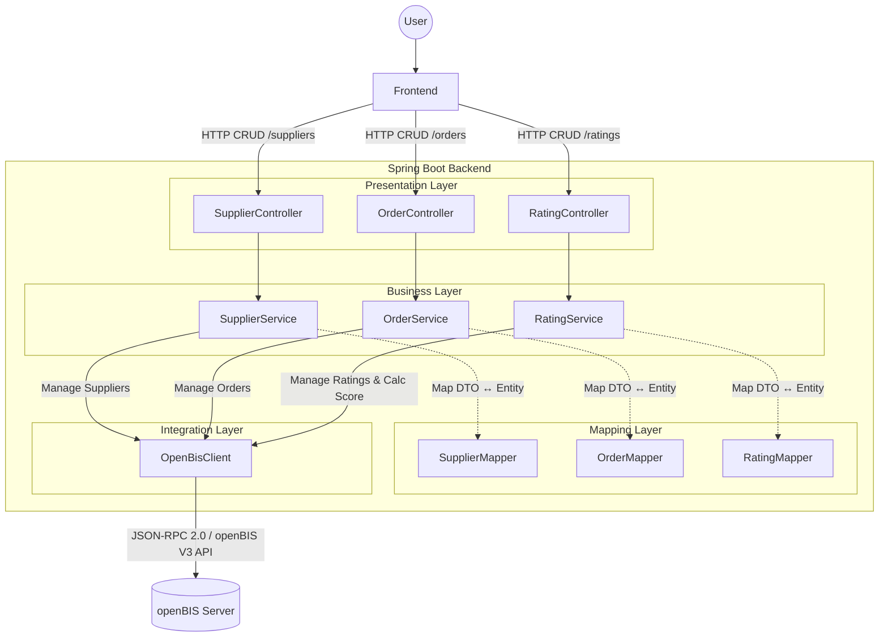

# Supplier Rating Software - Backend


This is the dedicated backend for the **Supplier Rating Software**, a specialized application
designed to streamline the evaluation and management of external partners within a scientific environment.

It acts as a high-performance middleware that bridges the gap between the modern Web
Frontend and the **openBIS** ELN-LIMS system. By abstracting the complex scientific data model of
openBIS, it exposes a clean, business-oriented REST API specifically tailored for supplier auditing,
order tracking, and performance scoring.

---

## 1. Key Features

### 🚀 Core Functionality

* **Supplier 360° View:** comprehensive management of supplier master data combined with real-time
  performance statistics calculated on-the-fly.
* **Automated Scoring Engine:** Automatically aggregates rating scores (Quality, Cost, Reliability)
  based on individual orders to generate a live "Total Score" for every supplier.
* **Hierarchical Order Management:** Enforces strict parent-child relationships (Supplier → Order
  → Rating) to ensure data integrity within the openBIS graph.

### 🛡️ Technical Highlights

* **Zero-Dependency Integration:** Communicates directly with the openBIS V3 API via JSON-RPC 2.0,
  eliminating the need for the heavy, legacy official Java libraries.
* **Strict Data Validation:** Implements custom Jakarta Bean Validation (`@OpenBisVocabulary`) to
  ensure all incoming data matches the strict controlled vocabularies of the openBIS schema before
  it ever reaches the database.
* **Type-Safe Architecture:** Converts untyped, generic openBIS maps (`Map<String, String>`) into
  strongly typed Java Records (`SupplierDetailDto`) to provide a stable contract for the Frontend.

---

## 2. Technologies Used

* **Language:** Java 25
* **Framework:** Spring Boot 4.0.0
* **Communication:** HTTP / JSON-RPC 2.0
* **Data Source:** OpenBIS V3 API (Scientific ELN-LIMS System)
* **Tools:** Lombok, Gradle, Jackson

---

## 3. Business Logic

The **Business Logic Layer** acts as the intelligent core of the application, transforming the
passive data storage of openBIS into a dynamic **Supplier Quality Management System**.

While openBIS provides the fundamental data structure (Entities & Properties), it lacks the
specific domain logic required for rating workflows. This layer fills that gap by
**orchestrating complex data retrieval**, **enforcing strict hierarchy rules**, and
**calculating performance metrics in real-time**. It ensures that the Frontend receives fully
processed, decision-ready data rather than raw database entries.

The core logic resides in the `service` package. It handles data aggregation, score calculations,
and hierarchical integrity between entities.

### 3.1. Supplier Management (`SupplierService`)

This service manages the master data and provides real-time performance insights.

* **On-the-fly Statistics:** Whenever a supplier is requested, the service fetches all associated
  orders and their ratings to calculate aggregate scores (e.g., `avgQuality`, `avgReliability`,
  `totalRatingCount`). These are not stored in openBIS but calculated live.
* **Dual View Strategy:**
    * **List View:** Returns a summary of all suppliers including their calculated statistics, but
      excludes the heavy list of individual orders to optimize performance.
    * **Detail View:** Returns the full supplier profile, including statistics and the complete history of orders.

### 3.2. Order Management (`OrderService`)

Manages Orders and ensures data integrity within the openBIS hierarchy.

* **Hierarchy Enforcement:** Ensures that every Order is strictly linked to an existing Supplier
  in a strict parent-Child relationship.
* **Data Flattening:** While openBIS stores data in a deep graph, this service delivers a "flat"
  `OrderDetailDto` to the frontend (containing direct references like `supplierName` and `ratingId`),
  simplifying frontend development.

### 3.3. Rating System (`RatingService`)

Handles the evaluation of orders based on multiple criteria (Quality, Cost, Reliability, Availability).

* **Automatic Scoring:** The `totalScore` is automatically calculated as the arithmetic mean of
  the individual sub-scores provided by the user.
* **One-to-One Relation:** Enforces that a Rating is always a child of exactly one Order and every
  Order has at most one Rating.

## 4. Architecture

The application follows a strict **Layered Architecture**. The primary goal is
to **decouple** the external data source (openBIS) from the API provided to the
Frontend.

This separation ensures:

1. **Stability:** Changes in the openBIS data model do not break the Frontend.
2. **Type Safety:** The backend converts untyped openBIS properties (Strings) into strongly typed Java Records.
3. **Encapsulation:** Complex business logic (like score calculation) is handled centrally in the backend.

### 4.1 The Layers

1. **Presentation Layer (Controllers):**
   Handles HTTP requests and validates inputs using strict DTO definitions.
   It knows *nothing* about openBIS or how data is fetched.

2. **Business Layer (Services):**
   Orchestrates the flow. It handles data retrieval strategies (shallow vs. deep fetching),
   ensures data integrity (parent-child relations), and performs calculations.

3. **Mapping Layer (Mappers):**
   The translation engine. It converts the technical `OpenBisSample` (Map structures)
   into clean, frontend-ready Domain Objects (`DetailDto`).

4. **Integration Layer (OpenBisClient):**
   Responsible for the low-level communication with the openBIS JSON-RPC API.
   It handles authentication and the raw wrapping/unwrapping of JSON-RPC envelopes.
   (See [Protocol & Request Specification](openBisRequestDoc.md) for details).

### 4.2 Request Flow Diagram

The following diagram illustrates the request flow from the external Frontend
through the internal layers to the openBIS system.



## 5. Code Organization

The source code structure mirrors the architectural layers defined in the previous section. It is
organized to strictly separate the domain-specific logic from the technical details of the openBIS integration.

```text
src/main/java/io/github/supplierratingsoftware/supplierratingbackend
├── config                                      // App configuration and property bindings
├── constant                                    // Application-wide constant definitions
│   ├── api                                     // Constants for API validation (Regex patterns, messages)
│   └── openbis                                 // Constants for OpenBIS integration (Schema codes, JSON-RPC types)
├── controller                                  // REST Controllers defining the API endpoints
├── dto                                         // Data Transfer Objects
│   ├── api                                     // Clean, validated DTOs for the REST API (Frontend contract)
│   └── openbis                                 // Technical DTOs mapping the openBIS V3 API structure
│       ├── creation                            // Objects for creating entities (e.g., SampleCreation)
│       ├── fetchoptions                        // Definition of data to retrieve (properties, hierarchy graph)
│       ├── generic                             // JSON-RPC 2.0 protocol envelopes (Request/Response wrappers)
│       ├── id                                  // Unique identifiers (PermIDs, Codes) to reference entities
│       ├── result                              // Data structures mapping openBIS responses (Samples, Search Results)
│       ├── search                              // Criteria objects for constructing search queries
│       └── update                              // Objects for updating existing entities
├── exception                                   // Centralized exception handling and custom exception definitions
├── integration.openbis                         // Low-level HTTP client for the OpenBIS JSON-RPC API
├── mapper                                      // Translation layer between domain objects (API) and technical objects (openBIS)
├── service                                     // Core business logic (calculations, statistics, orchestration)
├── util                                        // Helper classes for safe data parsing and property handling
└── validation                                  // Custom Jakarta Bean Validation extensions
    ├── annotation                              // Definition of custom constraints (e.g., for Controlled Vocabularies)
    └── validator                               // Implementation of the validation logic
```

## 6. Architectural Decision: Why not use the official openBIS Java API Library?

The official openBIS Java V3 API library relies heavily on the legacy `javax.*` namespace. This
creates a fundamental incompatibility with modern, secure frameworks (like Spring Boot 3+ or 4+) that
enforce the `jakarta.*` namespace.

To ensure long-term maintainability and avoid dependency conflicts ("Dependency Hell"), this
application deliberately avoids the official library. Instead, it implements a native, zero
dependency integration communicating directly with the openBIS V3 API via JSON-RPC using a modern
`RestClient` and customized DTOs.

> **Documentation:** For a detailed reference of the implemented JSON-RPC payloads, filtering strategies, and strict
> typing rules, please refer to the [OpenBIS Request Documentation](openBisRequestDoc.md).

## 7. Getting Started

### 7.1. How to configure openBIS

For the backend to function correctly, the openBIS instance requires a specific data model (Types) and a specific
storage structure (Hierarchy).

#### Step 1: Import Object Types (Schema)

The Entity Types (Sample Types) and Controlled Vocabularies are defined in the `.xlsx` files located in the
[openbis-schema](openbis-schema) folder of this repository.

Log in to the openBIS **Admin Dashboard** (ELN-LIMS UI) and go to the **TOOLS** tab.
Then navigate to **Import -> All**, click **CHOOSE FILE** to select the `.xlsx` files, and finally click **IMPORT**.

#### Step 2: Create Storage Hierarchy

Switch to the **Lab Notebook & Inventory Manager** (you might need to log out and then log in again if you were in the
admin dashboard) and manually create the specific Space, Projects, and Collections (Experiments) where the data will be
stored.

1. Go to the **INVENTORY** tab and click **+ Space** to create a new Space.
2. Inside that Space, click **+ Project** for each project to create them with the required Codes (see below).
3. Inside each Project, click **+ Other** and select **Collection** from the dropdown menu.
4. Fill out the form with the required Collection Code (see below) and select the **Default object type**
   corresponding to the table below.

The application expects exactly the following identifiers:

**1. Create a Space:**

* **Code:** `LIEFERANTENBEWERTUNG`

**2. Create Projects and Collections inside that Space:**

| Project Code   | Collection (Experiment) Code | Objects to store (Default Type) |
|:---------------|:-----------------------------|:--------------------------------|
| `LIEFERANTEN`  | `LIEFERANTEN`                | `LIEFERANT` (Supplier)          |
| `BESTELLUNGEN` | `BESTELLUNGEN`               | `BESTELLUNG` (Order)            |
| `BEWERTUNGEN`  | `BEWERTUNGEN`                | `BESTELLBEWERTUNG` (Rating)     |

> **Note:** Ensure that the created Collections are configured to accept the corresponding Object Types listed above.

> **Note:** Consult the official [openBIS documentation](https://openbis.readthedocs.io/en/6.x/) for more information
> on how to configure openBIS properly.

### 7.2. Installation Instructions

To install the application, you can choose between three different ways: From source, as a Docker
container with CORS enabled, or as a Docker container within a Docker Compose network with an
Nginx reverse proxy (CORS disabled).

- **Install from source with Gradle:** If you need to configure the Java code manually (Configuring Schema Constants,
  etc.). Useful for development purposes.
- **Install as Docker container:** If you want to use the provided `compose.yml` file and only need to configure the
  environment variables. Useful for local testing.
- **Install as Docker container within a Docker Compose network:** If you want to use a preconfigured Docker image
  (e.g., the one from this repository) within a larger infrastructure. CORS should be disabled when using behind a
  reverse proxy.

#### 7.2.1. Install application from source and run it directly with Gradle

##### 7.2.1.1 Prerequisites

- Java 25

##### 7.2.1.2 Installation (Cloning)

**Clone the Repository:** To configure the source files and run it from source, you need to clone the repository:

```bash
git clone https://github.com/SupplierRatingSoftware/supplierRatingBackend.git
```

##### 7.2.1.3 Configuration

**Configure the application:** To configure the application, you can edit the following files:

- `src/main/resources/application.yaml`: If you don't want to run the application in a Docker container, you have to
  make sure that you either set the needed environment variables yourself or set the properties directly in this file.
- In the source code inside `src/main/java/io/github/supplierratingsoftware/supplierratingbackend`:
    - `config.CorsConfig` to edit the allowed Frontend origins.
    - `constant.api.ValidationConstants` to edit the validation regex patterns for URLs, Dates, and Rating Score ranges.
    - `constant.openbis.OpenBisSchemaConstants` to edit the openBIS schema codes and vocabulary codes.
- To enable CORS, set `dev-local` as the active profile in `application.yaml`.
- To disable CORS, set `prod` as the active profile in `application.yaml`.

##### 7.2.1.4 Build / Run

**To build and run the application from source:** Run the following commands from within the repository:

```bash
./gradlew clean build
./gradlew bootRun
```

#### 7.2.2. Install and run application as Docker container

##### 7.2.2.1 Prerequisites

- Docker
- Docker Compose

##### 7.2.2.2 Installation (Pulling)

**A) If you want to configure more than just the environment variables:** Follow the steps
in [Section 7.2.1](#721-install-application-from-source-and-run-it-directly-with-gradle) to clone the repo
and edit the source files. But instead of editing the `application.yaml` file, you have to edit the `.env-development`
file (see below).

**B) If you want to use the provided Docker image:** Run the following command to pull the image:

```bash
docker pull ghcr.io/supplierratingsoftware/supplierratingbackend:latest
```

##### 7.2.2.3 Configuration

**A) If you cloned the repository:** For additional configuration, see the instructions
above(see [Section 7.2.1](#721-install-application-from-source-and-run-it-directly-with-gradle)).

**B) If you pulled the Docker image directly:**

1. Create a `.env-development` file to configure the environment variables (you can download the `.env-example` file
   from the repo and rename it).
2. To enable CORS, ensure the `SPRING_PROFILE_ACTIVE` variable is set to `dev-local` in the file.
3. To disable CORS, set it to `prod`.

##### 7.2.2.4 Run

**A) To run the application configured from source in a Docker container:** Run the following command from within the
repository:

```bash
docker compose up --build
```

**B) To run the application from the provided Docker image:** You must pass the environment file to the container:

```bash
docker run --env-file .env-development -p 8080:8080 ghcr.io/supplierratingsoftware/supplierratingbackend:latest
```

#### 7.2.3. Install application as Docker container within a Docker Compose network behind a reverse proxy

1. Follow the steps above to get the Backend Docker image.
2. Follow the steps above to disable CORS.
3. Follow the detailed instructions on
   the [Supplierrating Infrastructure Repo](https://github.com/SupplierRatingSoftware/supplierRatingInfrastructure).

### 7.3 Usage

To use this application, you can use any HTTP client (e.g., Curl, Postman, or a fully featured frontend) to send
requests to the backend.
The provided endpoints are documented here: [openapi.yaml](openapi.yaml)

## 8. Contributing

First off, thank you for considering contributing to the Supplier Rating Backend! 🚀

We welcome everyone who wants to make this project better—whether you're **fixing a bug**, **improving documentation**,
or **proposing a cool new feature**.

### 🤝 How can I contribute?

1. **Found a Bug?**
    * Ensure the bug was not already reported by searching on GitHub under [Issues](../../issues).
    * If not, open a new issue with a clear title and description.

2. **Have a Feature Idea?**
    * Great! We love new features. Please **open an issue first** to discuss your idea. This ensures that your feature
      fits into the architectural vision and prevents you from doing unnecessary work.

3. **Submit a Pull Request (PR)**
    * **Fork** the repository and create your branch from `main`.
    * **Code** your changes. Please stick to the existing code style.
    * **Test, Test, Test!** 🧪
        * Run `./gradlew test` **before you commit** to ensure the build is green.
        * **New Feature = New Test:** If you add functionality, you **must** add a corresponding unit or integration
          test. Code without tests will not be merged.
    * **Submit** the PR! We will review it as soon as possible.

### 📝 Coding Guidelines

To keep the codebase clean and maintainable, please keep the following in mind:

* **Respect the Architecture:** Keep the current layered architecture.
* **Commit Messages:** We prefer [Conventional Commits](https://www.conventionalcommits.org/) (e.g.,
  `feat: add new filter`, `fix: validation regex`) to keep the history readable.

Thank you for your support! ❤️

### 🚧 Looking for a Challenge? (Priority: High)

We currently use a static service account for openBIS authentication (defined in `application.yaml`). We want to migrate
to a **User-Centric Authentication Flow**.

**The Vision:** Users should log in via the Frontend using their openBIS Personal Access Token (PAT). The Backend
validates this against openBIS, retrieves a SessionToken, and wraps it into a **JWT** sent back to the Frontend.
Subsequent requests use this JWT, allowing the Backend to extract the SessionToken and execute requests on behalf of the
actual user (including handling token refreshes).

If you have experience with **Spring Security** and **JWT**, please check
out [Issue #50](https://github.com/SupplierRatingSoftware/supplierRatingBackend/issues/50) and help us implement this!

## 9. License

This project is licensed under the **MIT License** - see the [LICENSE](LICENSE) file for details.