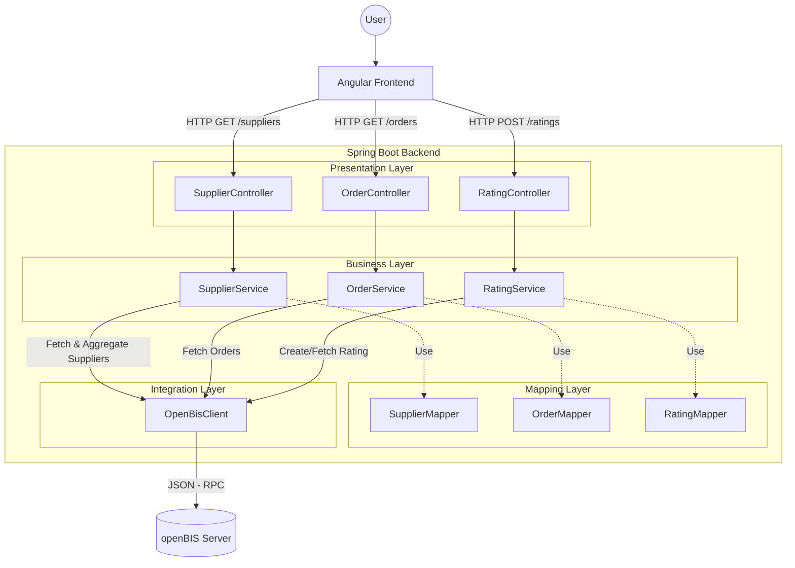

# Supplier Rating Software - Backend Architecture

This document outlines the architectural design, component structure, and data
flow of the Supplier Rating Backend application. The system is built using
Spring Boot 4 and Java 25, designed to serve as a RESTful middleware between a
modern Frontend and the openBIS data management system.

## 1. Architectural Philosophy

The application follows a strict **Layered Architecture**. The primary goal is
to decouple the external data source (openBIS) from the API provided to the
Frontend. This separation of concerns ensures that changes in the openBIS data
model do not directly impact the Frontend, and allows for business logic to be
encapsulated within the application.

### The Layers

1. **Presentation Layer (Controllers):**
   Handles HTTP requests, validates inputs, and maps domain objects to JSON
   responses. It knows *nothing* about openBIS or how data is fetched.

2. **Business Layer (Services):**
   Contains the core business logic. It orchestrates data retrieval, filters
   results, and calculates metrics (e.g., aggregations of ratings). It
   transforms raw data into clean Domain Objects.

3. **Integration Layer (OpenBIS Integration):**
   Responsible for the low-level communication with the openBIS JSON-RPC API.
   It handles authentication, session management, and the raw mapping of JSON
   responses. (See [Protocol & Request Specification](openBisRequestDoc.md)
   for details).

---

## 2. Package and File Structure

The project structure reflects the layered architecture. Below is the current and planned
layout with descriptions for each component.

```text
src/main/java/io/github/supplierratingsoftware/supplierratingbackend
├── config
│   ├── (R) OpenBisProperties.java              // Config properties (validated via Jakarta Validation)
│   └── (C) WebConfig.java                      // CORS and MVC configuration
├── constant
│   └── openbis
│       ├── (C) ConfigurationConstants.java     // Configuration constants (YAML prefixes)
│       ├── (C) OpenBisJsonConstants.java       // Technical JSON-RPC constants (@type, operators, etc.)
│       └── (C) OpenBisSchemaConstants.java     // Business Schema constants (Property Codes like "LIEFERANTEN_ORT")
├── controller                                  // REST API Endpoints
│   ├── (C) SupplierController.java             // Endpoints: /api/v1/suppliers
│   ├── (C) OrderController.java                // Endpoints: /api/v1/orders
│   └── (C) RatingController.java               // Endpoints: /api/v1/ratings
├── service                                     // Business Logic
│   ├── (C) SupplierService.java                // Logic for supplier data & mapping
│   ├── (C) OrderService.java                   // Logic for orders
│   └── (C) RatingService.java                  // Logic for creating/fetching ratings
├── integration
│   └── openbis
│       └── (C) OpenBisClient.java              // Low-level REST/JSON-RPC client
├── dto                                         // Data Transfer Objects
│   ├── api                                     // Clean DTOs sent to the Frontend
│   │   ├── (R) SupplierDto.java
│   │   ├── (R) OrderDto.java
│   │   ├── (R) RatingDto.java
│   │   └── (R) RatingStatsDto.java
│   └── openbis                                 // Technical DTOs for openBIS JSON-RPC
│       ├── generic                             // JSON-RPC Envelopes (Request/Response)
│       │   ├── (R) JsonRpcRequest.java
│       │   └── (R) JsonRpcResponse.java
│       ├── id                                  // Identifiers used to find/reference objects
│       │   ├── (R) OpenBisPermId.java
│       │   ├── (R) EntityTypePermId.java
│       │   └── (R) OpenBisEntityType.java
│       ├── search                              // Object definitions for building queries
│       │   ├── (I) SearchCriteria.java         // Generic interface for search criteria
│       │   ├── (C) AbstractCompositeSearchCriteria.java // Base class for composite logic
│       │   ├── (C) SampleSearchCriteria.java   // Root search container
│       │   ├── (C) SpaceSearchCriteria.java    // Space filter logic
│       │   ├── (C) ProjectSearchCriteria.java  // Project filter logic
│       │   ├── (C) SampleTypeSearchCriteria.java // Strict Type filter logic (KEY COMPONENT)
│       │   └── (C) CodeSearchCriteria.java     // Leaf filter
│       ├── fetchoptions                        // Control structures for lazy-loading
│       │   ├── (R) SampleFetchOptions.java
│       │   ├── (R) PropertyFetchOptions.java
│       │   └── (R) SampleTypeFetchOptions.java
│       └── result                              // Generic containers for returned data
│           ├── (R) OpenBisSearchResult.java
│           └── (R) OpenBisSample.java
├── mapper
│   ├── SupplierMapper.java                     // Maps DTOs in both directions toApiDto() & toOpenBisCreation()
│   ├── OrderMapper.java                        // Maps DTOs in both directions toApiDto() & toOpenBisCreation()
│   └── RatingMapper.java                       // Maps DTOs in both directions toApiDto() & toOpenBisCreation()
└── openBisRequestDoc.md                        // Detailed JSON-RPC Protocol Documentation
```

Legend:

- **(C)** = Class
- **(R)** = Record
- **(I)** = Interface

---

## 3. Component Communication and Business Logic

The application logic is partitioned into three main domains corresponding to the
frontend views: Suppliers, Orders, and Ratings. The backend acts as a stateless
middleware, fetching data from openBIS, applying business rules (such as
aggregation), and serving clean JSON to the frontend.

### A. Supplier Management (SupplierService)

* **Role:** Manages the lifecycle of supplier entities and calculates
  performance metrics.
* **Flow:**
    1. **Search/View:** `GET /suppliers` or `GET /suppliers/{id}`.
    2. **Aggregation:** When a supplier is requested, the service fetches
       linked Orders and their child Ratings from openBIS. It computes
       cumulative scores (e.g., Average Quality, Reliability, Cost) in memory.
        * *Note:* Aggregated data is **not** stored in openBIS to avoid
          redundancy; it is generated on-the-fly.
    3. **CRUD:** Supports creating and updating supplier master data in openBIS.
* **Data Structure (`SupplierDto`):** Contains master data (Address, Name)
  plus calculated fields (`averageRating`, `totalOrders`).

### B. Order Management (OrderService)

* **Role:** Manages orders and their relationship to suppliers.
* **Business Rules:**
    * Every Order belongs to exactly one Supplier.
    * An Order acts as the parent entity for a Rating.
* **Flow:**
    1. **Search/View:** `GET /orders`. Supports filtering by Supplier ID.
    2. **Modification:** Updates to order details (e.g., Status, Dates) are
       propagated to the corresponding openBIS Sample properties.
* **Data Structure (`OrderDto`):** Represents the commercial transaction,
  linking the `supplierId` (Parent) with the `orderNumber`.

### C. Rating Management (RatingService)

* **Role:** Handles the qualitative assessment of orders.
* **Business Rules:**
    * **Constraint:** An Order can have **0 or 1** Rating.
    * **Creation:** Checks if a rating already exists for the given order
      before creation.
    * **Update:** Allows modification of existing rating values.
* **Flow:**
    1. **View:** `GET /orders/{id}/rating` fetches the child sample of type
       `BESTELLBEWERTUNG`.
    2. **Create/Update:** `POST` or `PUT /ratings`. Maps input scores (1-5)
       and comments to openBIS properties.
* **Data Structure (`RatingDto`):** Contains the scoring data (Quality, Cost,
  Reliability) and the reference `orderId`.

---

## 4. Key Architectural Concepts

To maintain a clean architecture and handle the complexity of the openBIS V3 API,
the following patterns are strictly enforced.

### 4.1. Dual DTO Strategy

The application maintains two distinct sets of Data Transfer Objects to separate
the API contract from the data source implementation.

1. **`dto.openbis` (Technical Layer):**
    * Mirrors the complex structure of the openBIS V3 JSON-RPC API.
    * Includes classes for `JsonRpcRequest`, `SearchCriteria`, `FetchOptions`,
      and `OpenBisSample` (containing raw nested maps).
    * *Purpose:* Ensures type-safe serialization/deserialization of JSON-RPC
      messages.

2. **`dto.api` (Presentation Layer):**
    * Clean, flat Java Records defined by the `openapi.yaml` specification.
    * Contains user-friendly fields (e.g., `String street`) instead of raw
      property maps.
    * *Purpose:* Provides a stable contract for the Angular Frontend, independent
      of changes in the openBIS data model.

### 4.2. Entity Mapping

Dedicated **Mapper components** (e.g., `SupplierMapper`) are responsible for transforming data between the two
DTO layers.

* **Inbound (API -> OpenBIS):** Converts simple fields from a `SupplierDto`
  into the generic `Map<String, String>` property structure required for
  openBIS Sample creation/update.
* **Outbound (OpenBIS -> API):** Extracts specific values from openBIS
  properties (e.g., `LIEFERANTEN_ORT`) and maps them to API fields
  (e.g., `city`). Isolating this logic prevents "magic strings" from
  spreading throughout the service layer.

### 4.3. Fetch Options (Lazy Loading)

OpenBIS utilizes a "lazy loading" philosophy. By default, searching for a
sample returns only its basic identifiers. To retrieve metadata (properties) or
related objects (parents/children), **Fetch Options** must be explicitly defined.

* **Mechanism:** The Domain Services (e.g., `SupplierService`) construct specific
  `FetchOptions` objects (e.g., `new SampleFetchOptions(..., new SampleTypeFetchOptions())`).
* **Optimization:** We only fetch the data required for the specific use case.
    * *List View:* Fetches basic properties.
    * *Detail View:* Fetches properties, parent suppliers, and child ratings.

### 4.4 The Generic Data Model Strategy

A critical architectural distinction in this system is the handling of the
openBIS data model. Unlike traditional relational databases or JPA/Hibernate
setups where specific tables map 1:1 to specific Java entities (e.g., a
`SupplierEntity` class), openBIS utilizes a **Generic Meta-Model**.

#### The Concept

In the openBIS V3 API, there are no specific classes for "Supplier", "Order", or
"Rating". Technically, all these entities are instances of the same generic
class: **`OpenBisSample`**.

Distinctions are made solely via the `type` field and the contents of a dynamic
properties map. This necessitates a translation layer within the application.

#### Translation Example

**1. The "Raw" View (Inside openBIS / `dto.openbis`)**
When the `OpenBisClient` receives data, it deserializes it into the generic
`OpenBisSample` record. The business data is hidden inside a `Map<String, String>`.

```java
// Conceptual representation of a "Supplier" in the integration layer
OpenBisSample genericSample = new OpenBisSample(
                new OpenBisPermId("20240505-123"),
                new OpenBisEntityType("LIEFERANT"),
                "LIEFERANT64",
                Map.of(                 // properties map
                        "NAME", "Müller AG",
                        "LIEFERANTEN_ORT", "Zurich",
                        "KUNDENNUMMER", "503572"
                )
        );
```

**2. The "Domain" View (Inside Application / `dto.api`)**
The application core and the Frontend require a type-safe, explicit structure.
The `SupplierMapper` is responsible for extracting values from the map keys and
injecting them into the named fields of the API DTO.

```java
// Logic inside SupplierMapper.java
public SupplierDto toDto(OpenBisSample sample) {
    Map<String, String> props = sample.properties();

    return new SupplierDto(
            props.get("NAME"),              // name
            props.get("KUNDENNUMMER"),      // customerNumber
            props.get("LIEFERANTEN_ZUSATZ"),// addition
            // ... mapping other fields ...
            sample.permId().permId(),       // id
            sample.code(),                  // code
            null                            // stats (calculated later)
    );
}
```

**Architectural Benefit:**
This decoupling ensures that specific openBIS internal codes (e.g.,
`LIEFERANTEN_ORT`) are isolated within the `EntityMapper`. If the openBIS data
model changes (e.g., a property code is renamed), only the Mapper needs to be
updated, while the Controller, Service, and Frontend logic remain untouched.

---

## 5. Architecture Diagram

The following diagram illustrates the request flow from the external Frontend
through the internal layers to the openBIS system.



---

## 6. Design Decisions

### Records vs. Classes for DTOs

We utilize a hybrid approach for Data Transfer Objects:

* **Java Records (Response/Data):** Used for API DTOs (`SupplierDto`) and openBIS Results
  (`OpenBisSample`). Records provide immutability and conciseness for data carriers.
* **Java Classes (Search Criteria):** Used for the openBIS Search Criteria hierarchy
  (`SampleSearchCriteria`, `SpaceSearchCriteria`). We use **Classes** here to implement
  the **Composite Pattern** via inheritance (`AbstractCompositeSearchCriteria`). This allows for
  a fluent API (`.with(...)`) and shared logic for nested criteria lists, which is not
  possible with Records.

### Native JSON-RPC Integration

Instead of relying on heavy, third-party libraries or the official Java V3 API
(which can be cumbersome to configure for simple use cases), this application
implements a lightweight, native JSON-RPC client using `RestClient`.

* **Control:** We have full control over the request structure.
* **Transparency:** The specific `JsonRpcRequest` and `JsonRpcResponse` wrappers
  make the communication protocol explicit and easy to debug.

> **Documentation:** For a detailed reference of the implemented JSON-RPC payloads, filtering strategies, and strict
> typing rules, please refer to the [OpenBIS Request Documentation](openBisRequestDoc.md).

### Direct Service-to-Client Communication

In the initial design, an `OpenBisService` layer was planned to abstract the client.
However, to reduce complexity and boilerplate, Domain Services (e.g., `SupplierService`)
now interact directly with `OpenBisClient`.

* **Responsibility:** The `SupplierService` constructs the domain-specific `SearchCriteria` (e.g., filtering by Space
  and Project) and passes them to the generic `OpenBisClient`.
* **Benefit:** This keeps the `OpenBisClient` purely technical (transport layer) while the business logic (which
  Space/Project to search) resides in the Service Layer.
