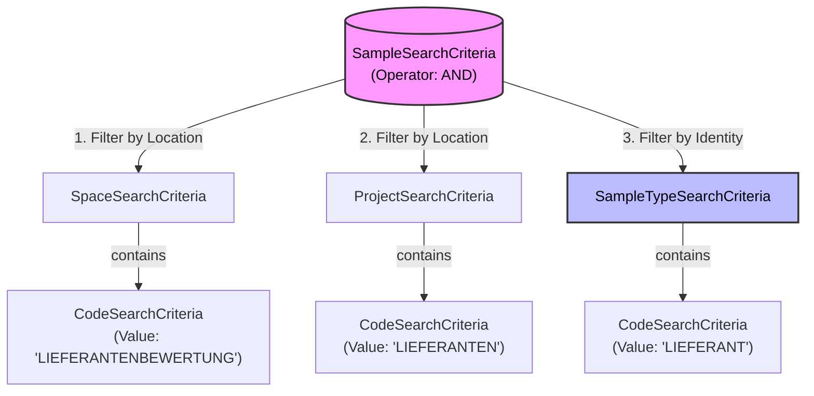
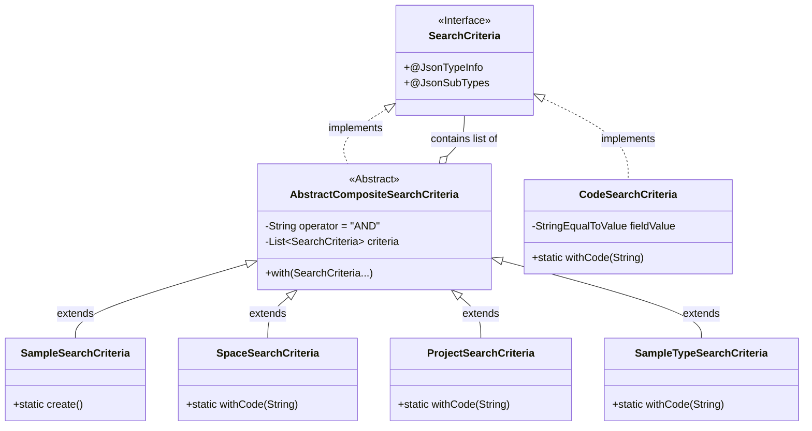

# OpenBIS V3 API Integration Documentation

## 1. Introduction & General API Concepts

### 1.1. Purpose of this Document

This document serves as the technical reference for the integration between the **Supplier Rating
Backend** (Spring Boot) and the **OpenBIS V3 Application Server**. It details the mechanism used to
translate internal Java Data Transfer Objects (DTOs) into the specific JSON-RPC 2.0 payloads required
by the OpenBIS API.

The primary focus is on the **Search API (`searchSamples`)**, documenting the strict filtering
strategies and recursive fetching logic implemented to retrieve hierarchical data (Suppliers, Orders,
and Ratings) reliably.

### 1.2. OpenBIS V3 JSON-RPC Fundamentals

The integration communicates exclusively via the OpenBIS V3 JSON-RPC endpoint. This API is stateless
and follows the standard JSON-RPC 2.0 specification.

* **Endpoint URL:** `https://<your-server>/openbis/openbis/rmi-application-server-v3.json`
* **HTTP Method:** `POST`
* **Content-Type:** `application/json` (Request), `application/json-rpc` (Response)
* **Serialization:** The API relies heavily on polymorphism. JSON objects must include a `@type`
  discriminator field (e.g., `@type: "as.dto.sample.search.SampleSearchCriteria"`) so the server
  can deserialize them into the correct Java classes.

### 1.3. Standard Request Structure

For data retrieval operations, the application uses the `searchSamples` method. The `params` array
in these requests strictly adheres to a fixed structure containing exactly **three elements**.

**The Three Pillars of a Search Request:**

1.  **Session Token (`String`):**
    The authentication string obtained via the `login` method. It identifies the user context for
    the operation.

2.  **Search Criteria (`SampleSearchCriteria`):**
    Defines **WHICH** entities to find. This utilizes a composite pattern to combine multiple filters
    (Space, Project, Type) using logical operators (AND/OR).

3.  **Fetch Options (`SampleFetchOptions`):**
    Defines **WHAT** data to load for the found entities. This controls the depth of the graph
    traversal (e.g., "load properties", "load parents", "load children").

**Generic JSON-RPC Envelope:**

```json
{
  "jsonrpc": "2.0",
  "method": "searchSamples",
  "id": "unique-request-id",
  "params": [
    "SESSION_TOKEN_STRING",       // 1. Authentication
    {                             // 2. Criteria (Filter)
      "@type": "as.dto.sample.search.SampleSearchCriteria",
      "operator": "AND",
      "criteria": [ ... ]
    },
    {                             // 3. Fetch Options (Depth)
      "@type": "as.dto.sample.fetchoptions.SampleFetchOptions",
      "properties": { ... },
      "type": { ... }
    }
  ]
}
```

## 2. Search & Filtering Strategy

### 2.1. The "Strict Filtering" Approach

To ensure data integrity and prevent "ghost data" (e.g., test entries, experimental samples, or misclassified
objects) from appearing in the application, the backend implements a **Strict Filtering Strategy**.

Previous implementations relied solely on the "Location" of a sample (Space and Project). However, openBIS
projects often contain heterogeneous data. For example, a project named `BESTELLUNGEN` might contain valid
`BESTELLUNG` objects, but also temporary `ENTRY` objects or experimental data.

**The Rule:**
Every search request must define the **Location** (Space + Project) AND the **Identity** (Sample Type) of the
target entities. This triple-constraint ensures that the API returns only valid business objects.

### 2.2. Search Criteria Composition

The search logic utilizes the openBIS **Composite Pattern**. The root `SampleSearchCriteria` acts as a
container that combines multiple sub-criteria using a logical `AND` operator.

**The Three Required Dimensions:**

1.  **Space Criteria:** Restricts the search to a specific Space (e.g., `LIEFERANTENBEWERTUNG`).
2.  **Project Criteria:** Restricts the search to a specific Project (e.g., `LIEFERANTEN`).
3.  **Type Criteria:** Restricts the search to a specific Sample Type (e.g., `LIEFERANT`).

**Criteria Composition Diagram:**



### 2.3. Why "Sample Type" is Mandatory

The inclusion of `SampleTypeSearchCriteria` is the result of specific architectural learnings:

* **Polymorphism Safety:** openBIS allows different entity types to coexist in the same collection.
  Filtering by type delegates the validation logic to the database engine, rather than filtering in
  Java memory.
* **Exclusion of Test Data:** Developers often create generic samples (default type `ENTRY`) for testing.
  Without type filtering, these objects appear in the API response, causing mapping errors because they lack
  business properties (e.g., missing `Name` or `Address`).
* **Performance:** Narrowing the search scope on the server side reduces the payload size and serialization overhead.

## 3. Java DTO Architecture & Request Composition

### 3.1. The Composite Pattern in Search Criteria

The OpenBIS V3 API employs the **Composite Design Pattern** for its search criteria. This design allows
complex, nested queries to be constructed dynamically. Unlike flat DTOs where properties are set directly
(e.g., `setSpace("SPACE")`), criteria objects act as **containers** holding lists of sub-criteria.

**Architectural Rules:**

1.  **Container Classes:** High-level criteria (like `SampleSearchCriteria`, `SpaceSearchCriteria`,
    `ProjectSearchCriteria`) extend `AbstractCompositeSearchCriteria`. They do not hold values directly.
2.  **Leaf Criteria:** Specific value matching is done by leaf criteria (like `CodeSearchCriteria`)
    which are added to the container's list.
3.  **Logical Operator:** Every container defines an operator (default: `AND`) to combine its sub-criteria.

**Java Implementation Strategy:**
The backend mimics this structure using a fluent API.
* **Base Class:** `AbstractCompositeSearchCriteria` provides the `criteria` list and `operator` field.
* **Fluent Method:** The `with(SearchCriteria... criteria)` method allows chaining criteria addition.

### 3.2. Polymorphism Handling (Jackson & `@type`)

A critical aspect of the integration is how Java objects are serialized into the specific JSON format
expected by OpenBIS. The API relies heavily on polymorphism, meaning a list of criteria can contain
objects of many different classes.

To support this, the application uses **Jackson Polymorphic Serialization**:

1.  **Discriminator Field (`@type`):**
    Every DTO sent to OpenBIS must include a meta-property named `@type`. This string tells the OpenBIS
    server which server-side Java class corresponds to the JSON object.

2.  **Interface Configuration (`SearchCriteria.java`):**
    The root interface uses `@JsonTypeInfo` and `@JsonSubTypes` to map Java classes to their OpenBIS
    type names.

    * `SampleSearchCriteria` &rarr; `"as.dto.sample.search.SampleSearchCriteria"`
    * `SampleTypeSearchCriteria` &rarr; `"as.dto.sample.search.SampleTypeSearchCriteria"`
    * `CodeSearchCriteria` &rarr; `"as.dto.common.search.CodeSearchCriteria"`

**Impact of Incorrect Configuration:**
If a subtype is missing from the `@JsonSubTypes` annotation, Jackson will fail to serialize the `@type`
field (or serialize it incorrectly). OpenBIS will subsequently ignore that specific filter, leading to
unfiltered "ghost data" being returned.

### 3.3. DTO Composition Diagram

The following class diagram illustrates how the backend internal DTOs are structured to enforce the
Composite Pattern and ensure correct JSON generation.



## 4. Domain Entity Request Specifications

This section defines the precise filtering logic and JSON payloads used to retrieve specific business
entities. It serves as the reference implementation for any new service added to the backend.

### 4.1. Authentication (Login)

**Context:**
Before any search or retrieval operation can be performed, the client must authenticate against the
openBIS Application Server to obtain a **Session Token**. This token identifies the user and must be
included as the first parameter in every subsequent API call.

* **Responsible Component:** `OpenBisClient`
* **Method:** `login`
* **Return Value:** A String representing the Session Token (e.g., `admin-12345...`).

**Logic:**
The `login` method in the V3 API is straightforward. It does not require complex criteria objects,
only the credentials passed as a list of strings.

**Reference JSON Payload:**

```json
{
  "jsonrpc": "2.0",
  "method": "login",
  "id": "req-login-01",
  "params": [
    "username",       // 1. OpenBIS Username
    "password"        // 2. OpenBIS Password
  ]
}
```

**Response Handling:**
* **Success:** The `result` field contains the session token string.
* **Failure:** The `error` field contains authentication failure details.

**Usage in subsequent requests:**
The token received here is cached by the `OpenBisClient` and inserted into index `0` of the
`params` array for all `searchSamples` calls (see Scenarios A, B, and C).

```java
// Conceptual Usage
String sessionToken = login(); // returns "admin-12345..."

// Next request (e.g. searchSamples)
List<Object> params = new ArrayList<>();
params.add(sessionToken); // Index 0: Token
params.add(searchCriteria);
params.add(fetchOptions);
```

### 4.2. Retrieving Suppliers (Root Entities)

**Context:**
Suppliers are the root entities in the hierarchy. They have no parents in this context but serve as parents to Orders.

* **Responsible Service:** `SupplierService`
* **Search Scope:** Space + Project + Type

**Filtering Logic:**
1.  **Space:** Configured Default Space (e.g., `LIEFERANTENBEWERTUNG`)
2.  **Project:** Configured Supplier Project (e.g., `LIEFERANTEN`)
3.  **Type:** Configured Supplier Type (e.g., `LIEFERANT`)

**Reference JSON Payload:**

```json
{
  "jsonrpc": "2.0",
  "method": "searchSamples",
  "id": "req-supplier-01",
  "params": [
    "SESSION_TOKEN",
    {
      "@type": "as.dto.sample.search.SampleSearchCriteria",
      "operator": "AND",
      "criteria": [
        {
          "@type": "as.dto.space.search.SpaceSearchCriteria",
          "operator": "AND",
          "criteria": [
            {
              "@type": "as.dto.common.search.CodeSearchCriteria",
              "fieldValue": {
                "@type": "as.dto.common.search.StringEqualToValue",
                "value": "LIEFERANTENBEWERTUNG"
              }
            }
          ]
        },
        {
          "@type": "as.dto.project.search.ProjectSearchCriteria",
          "operator": "AND",
          "criteria": [
            {
              "@type": "as.dto.common.search.CodeSearchCriteria",
              "fieldValue": {
                "@type": "as.dto.common.search.StringEqualToValue",
                "value": "LIEFERANTEN"
              }
            }
          ]
        },
        {
          "@type": "as.dto.sample.search.SampleTypeSearchCriteria",
          "operator": "AND",
          "criteria": [
            {
              "@type": "as.dto.common.search.CodeSearchCriteria",
              "fieldValue": {
                "@type": "as.dto.common.search.StringEqualToValue",
                "value": "LIEFERANT"
              }
            }
          ]
        }
      ]
    },
    {
      "@type": "as.dto.sample.fetchoptions.SampleFetchOptions",
      "properties": {
        "@type": "as.dto.property.fetchoptions.PropertyFetchOptions"
      },
      "type": {
        "@type": "as.dto.sample.fetchoptions.SampleTypeFetchOptions"
      }
    }
  ]
}
```

### 4.3. Retrieving Orders (Child Entities)

**Context:**
Orders represent the second level of the hierarchy. They are children of Suppliers. To reconstruct this relationship in the application, the request must explicitly fetch the parent objects.

* **Responsible Service:** `OrderService`
* **Search Scope:** Space + Project + Type
* **Hierarchy Requirement:** Must fetch immediate parents to link the Order to a Supplier ID.

**Filtering Logic:**
1.  **Space:** Configured Default Space
2.  **Project:** Configured Order Project (e.g., `BESTELLUNGEN`)
3.  **Type:** Configured Order Type (e.g., `BESTELLUNG`)

**Reference JSON Payload (with Parents Fetch):**

```json
{
  "jsonrpc": "2.0",
  "method": "searchSamples",
  "id": "req-order-01",
  "params": [
    "SESSION_TOKEN",
    {
      "@type": "as.dto.sample.search.SampleSearchCriteria",
      "operator": "AND",
      "criteria": [
        {
          "@type": "as.dto.space.search.SpaceSearchCriteria",
          "operator": "AND",
          "criteria": [
            {
              "@type": "as.dto.common.search.CodeSearchCriteria",
              "fieldValue": {
                "@type": "as.dto.common.search.StringEqualToValue",
                "value": "LIEFERANTENBEWERTUNG"
              }
            }
          ]
        },
        {
          "@type": "as.dto.project.search.ProjectSearchCriteria",
          "operator": "AND",
          "criteria": [
            {
              "@type": "as.dto.common.search.CodeSearchCriteria",
              "fieldValue": {
                "@type": "as.dto.common.search.StringEqualToValue",
                "value": "BESTELLUNGEN"
              }
            }
          ]
        },
        {
          "@type": "as.dto.sample.search.SampleTypeSearchCriteria",
          "operator": "AND",
          "criteria": [
            {
              "@type": "as.dto.common.search.CodeSearchCriteria",
              "fieldValue": {
                "@type": "as.dto.common.search.StringEqualToValue",
                "value": "BESTELLUNG"
              }
            }
          ]
        }
      ]
    },
    {
      "@type": "as.dto.sample.fetchoptions.SampleFetchOptions",
      "properties": {
        "@type": "as.dto.property.fetchoptions.PropertyFetchOptions"
      },
      "type": {
        "@type": "as.dto.sample.fetchoptions.SampleTypeFetchOptions"
      },
      "parents": {
        "@type": "as.dto.sample.fetchoptions.SampleFetchOptions",
        "properties": null,
        "type": null,
        "parents": null
      }
    }
  ]
}
```

### 4.4. Retrieving Ratings (Leaf Entities)

**Context:**
Ratings represent the third level of the hierarchy (Leaf nodes). They are children of Orders.
To link a rating back to the specific order it belongs to, the request must explicitly fetch the
parent objects.

* **Responsible Service:** `RatingService`
* **Search Scope:** Space + Project + Type
* **Hierarchy Requirement:** Must fetch immediate parents to link the Rating to an Order ID.

**Filtering Logic:**
1.  **Space:** Configured Default Space (e.g., `LIEFERANTENBEWERTUNG`)
2.  **Project:** Configured Rating Project (e.g., `BEWERTUNGEN`)
3.  **Type:** Configured Rating Type (e.g., `BESTELLBEWERTUNG`)

**Reference JSON Payload:**

```json
{
  "jsonrpc": "2.0",
  "method": "searchSamples",
  "id": "req-rating-01",
  "params": [
    "SESSION_TOKEN",
    {
      "@type": "as.dto.sample.search.SampleSearchCriteria",
      "operator": "AND",
      "criteria": [
        {
          "@type": "as.dto.space.search.SpaceSearchCriteria",
          "operator": "AND",
          "criteria": [
            {
              "@type": "as.dto.common.search.CodeSearchCriteria",
              "fieldValue": {
                "@type": "as.dto.common.search.StringEqualToValue",
                "value": "LIEFERANTENBEWERTUNG"
              }
            }
          ]
        },
        {
          "@type": "as.dto.project.search.ProjectSearchCriteria",
          "operator": "AND",
          "criteria": [
            {
              "@type": "as.dto.common.search.CodeSearchCriteria",
              "fieldValue": {
                "@type": "as.dto.common.search.StringEqualToValue",
                "value": "BEWERTUNGEN"
              }
            }
          ]
        },
        {
          "@type": "as.dto.sample.search.SampleTypeSearchCriteria",
          "operator": "AND",
          "criteria": [
            {
              "@type": "as.dto.common.search.CodeSearchCriteria",
              "fieldValue": {
                "@type": "as.dto.common.search.StringEqualToValue",
                "value": "BESTELLBEWERTUNG"
              }
            }
          ]
        }
      ]
    },
    {
      "@type": "as.dto.sample.fetchoptions.SampleFetchOptions",
      "properties": {
        "@type": "as.dto.property.fetchoptions.PropertyFetchOptions"
      },
      "type": {
        "@type": "as.dto.sample.fetchoptions.SampleTypeFetchOptions"
      },
      "parents": {
        "@type": "as.dto.sample.fetchoptions.SampleFetchOptions",
        "properties": null,
        "type": null,
        "parents": null
      }
    }
  ]
}
```

## 5. Fetch Options & Response Handling

### 5.1. Understanding `SampleFetchOptions`

In the OpenBIS V3 API, search criteria determine **which** entities are returned, while
`FetchOptions` determine **what data** is loaded for those entities.

OpenBIS uses a "lazy loading" philosophy by default. If you search for a sample without specifying
fetch options, the server returns a skeleton object containing only basic identifiers (PermId, Code).
To access business data (like `NAME`, `DATE`, or relationships), the client must explicitly request
these details.

**Key Components of `SampleFetchOptions`:**

* **`properties` (`PropertyFetchOptions`):**
  Instructs the server to load the `properties` map (key-value pairs). This is where custom
  metadata (e.g., "LIEFERANTEN_ORT", "BESTELLDATUM") is stored.
* **`type` (`SampleTypeFetchOptions`):**
  Instructs the server to load the `SampleType` definition. Useful for verifying the entity kind.
* **`parents` / `children` (`SampleFetchOptions`):**
  Controls graph traversal to load related entities.

### 5.2. Recursive Fetching (Parents & Hierarchy)

Our data model is hierarchical (`Supplier` &larr; `Order` &larr; `Rating`). To reconstruct these
relationships in the backend without making N+1 API calls, we use **Recursive Fetch Options**.

Since `SampleFetchOptions` contains fields for `parents` (which are themselves `SampleFetchOptions`),
we can nest these options to define the depth of the graph retrieval.

**Example: Fetching a Rating with its Order**

To link a Rating to an Order, we fetch the rating's properties and its immediate parent. Note that
we do *not* need the parent's properties, only its Identity (PermId).

```json
{
  "@type": "as.dto.sample.fetchoptions.SampleFetchOptions",
  "properties": {
    "@type": "as.dto.property.fetchoptions.PropertyFetchOptions"
  },
  "parents": {
    "@type": "as.dto.sample.fetchoptions.SampleFetchOptions",
    "properties": null, // Optimization: We don't need Order properties here
    "type": null,       // Optimization: We don't need Order type here
    "parents": null     // Stop recursion: We don't need the Supplier here
  }
}
```

**Optimization Strategy:**
We strictly limit the fetch depth. For a Rating, we only fetch `parents` (Order). We do not fetch
`parents.parents` (Supplier), as the API design usually requires only the immediate foreign key
(`orderId`) to link objects.

### 5.3. Response Structure & Mapping

The JSON-RPC response returns an `OpenBisSearchResult` containing a list of `OpenBisSample` objects.
The structure of these objects mirrors the requested Fetch Options.

**Response Object Structure (Simplified):**

```json
{
  "permId": { "permId": "20231201-123" },
  "code": "RATING_456",
  "properties": {
    "QUALITAET": "5",
    "KOMMENTAR": "Excellent service"
  },
  "parents": [
    {
      "permId": { "permId": "20231130-999" }, // The Order ID
      "code": "BESTELLUNG_999",
      "properties": null // Null because we didn't request them
    }
  ]
}
```

**Mapping Logic (Java):**

The backend Mappers (`RatingMapper`, `OrderMapper`) are responsible for flattening this structure
into API DTOs.

1.  **Properties:** Accessed via `sample.getProperties().get("KEY")`. Safe handling for null maps
    is required.
2.  **Relationships:** Accessed via `sample.getParents()`.
    * Since our model enforces a strict hierarchy, we typically expect exactly **one** parent for
      Orders and Ratings.
    * The Mapper extracts `parents.get(0).getPermId().getPermId()` to populate fields like
      `orderId` or `supplierId`.

**Error Handling:**
If a required parent is missing (e.g., an orphan Order), the Mapper should handle this gracefully
(e.g., setting the ID to null) rather than throwing an `IndexOutOfBoundsException`.

**Safe Mapping Example (Java):**

```java
public RatingDto mapToDto(OpenBisSample sample) {
    // 1. Map simple properties (with null checks handled by Map.getOrDefault or similar)
    String quality = sample.getProperties().get("QUALITAET");
    
    // 2. Map Parent ID (Foreign Key) safely
    String orderId = null;
    List<OpenBisSample> parents = sample.getParents();
    
    // Check if parents exist and list is not empty
    if (parents != null && !parents.isEmpty()) {
        OpenBisSample parentOrder = parents.get(0);
        if (parentOrder.getPermId() != null) {
            orderId = parentOrder.getPermId().getPermId();
        }
    } else {
        // Log warning: Orphan rating found
        log.warn("Rating {} has no parent order linked!", sample.getCode());
    }

    return new RatingDto(..., orderId, ...);
}
```